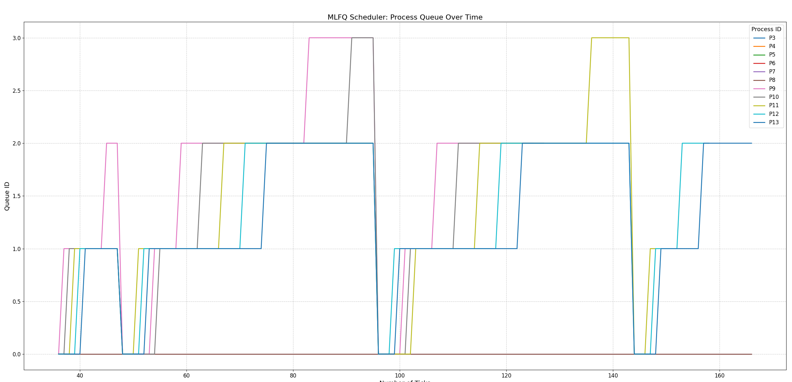
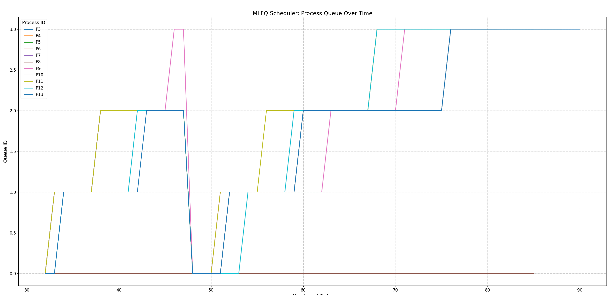
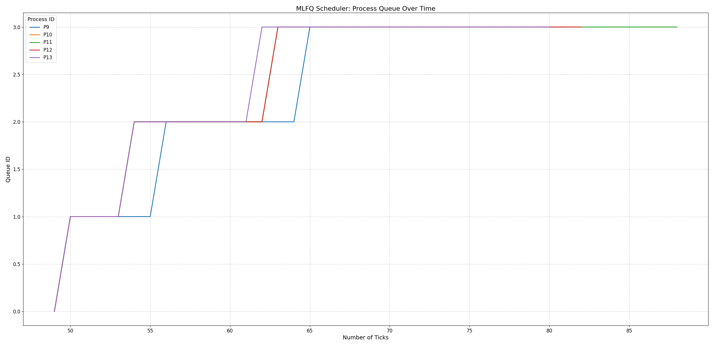
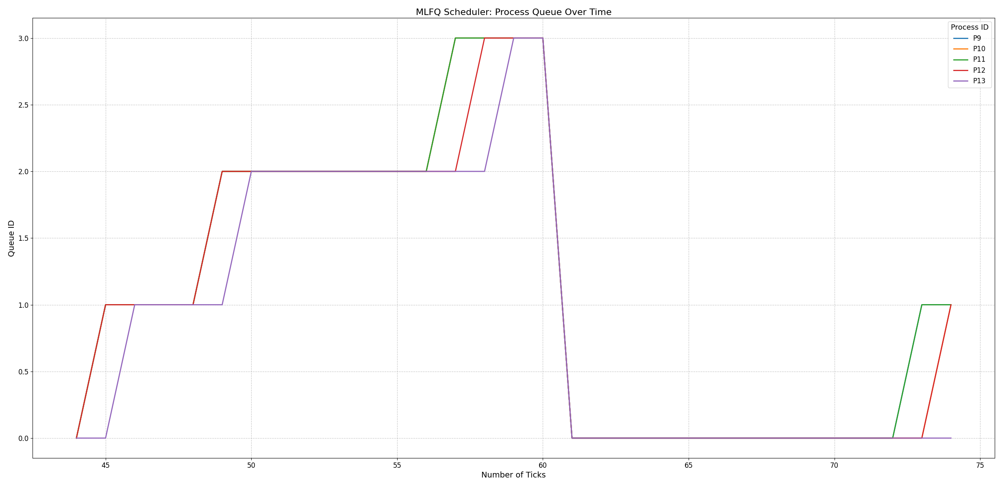

# xv6
## System calls
### 1. Gotta count them all
Implemented a new system call `getSysCount()` which is responsible for giving the mask to the process and returning the count for the same.

Also added a user command `syscount` which in turn makes use of the `getSysCount()` command to set our masks and get the count for the same.

For example, to get the number of times the `ith` system call was called, the mask is specified as `1 << i`.

Syntax: `syscount <mask> command [args]`


Output: `PID <caller pid> called <syscall name> <n> times.`

Changes made:

 1) Added two more fields in our proc structure in `kernel/proc.h` `int sys_c[33]` and `int sys_mask;` where `sys_c` is an array which stores out count for each process and `sys_mask` stores the mask if present. The mask is only given to function calling `getSysCount` others have it set to `0` by default.
 2) In `kernel/proc.c` under `allocproc` initialize both fields as 

    ```
    memset(p->sys_c,0,sizeof(p->sys_c)/sizeof(p->sys_c[0]));
    p->sys_mask=0;
    ```
 3) Fill `sys_c` as zeros in `fork()` using memset to prevent child from copying the field from its parent also set child's mask as 0.
 4) In `kernel/proc.c` under `exit()` function we update the `sys_c` for the parent of the exiting child where we add the number of system calls made by the child to the parent's. 

    ```
    for(int i=0;i<sizeof(p->sys_c)/sizeof(p->sys_c[0]);i++){
        p->parent->sys_c[i]+=p->sys_c[i];
    }
    ```
 5) In `kernel/syscall.c` under the function `void syscall(void)` increment the `sys_c` for the corresponding process according to the call being made using `p->sys_c[num]++;` .
 6) In `kernel/syscall.c` add the following 
    ```
    extern uint64 sys_getSysCount(void);

    static uint64 (*syscalls[])(void) = {
    ...
    [SYS_getsyscount] sys_getsyscount,
    ...
    }
    ```
 7) In `kernel/syscall.h` add `#define SYS_getSysCount 23`. 
 8) In `kernel/sysproc.c` added `uint64 sys_settickets(void)`.
 9) In `user/user.h` added `int getSysCount(int)`.
 10) In `user/usys.pl` added `entry("getSysCount");`.
 11) In `user` added a file `syscount.c` which contains the logic for the call.
 12) In `Makefile` add
        ```
        UPROGS=\
        ...
        $U/_syscount\
        ...
        ```

Logic:

Only the function calling the `getSysCount()` is given the mask. The count is incremented for each process regardless of the mask when it makes a system call. When a child exits it updates the corresponding calls for its parent.

### Wake me up when my timer ends
Added two new system calls `sigalarm` and `sigreturn`.

Syntax: `sigalarm(interval,handler)` and `sigreturn()`.

`sigalarm(interval n,handler)` for every `n` ticks of cpu sigalarm calls the handler function.

`sigreturn()` restores the processs state to the previous state after the handler returns.

Changes made:

1) In `kernel/proc.h` add a few fields.
    ```
    int cputicks;                 //interval after which handler will be called
    int tickcount;                //ticks used
    struct trapframe *savedtf;    //initial trapframe(to be restored after handler returns)
    void (*handler)();            //pointer to handler function
    int handlerflag;              //falg to check if handler is active or not
    ```
2) Initialize all of them to `0` in `allocproc` in `kerenel/proc.c`
3) In `kernel/syscall.c` add the following 
    ```
    extern uint64 sys_sigalarm(void);
    extern uint64 sys_sigreturn(void);

    static uint64 (*syscalls[])(void) = {
    ...
    [SYS_sigalarm]      sys_sigalarm,
    [SYS_sigreturn]     sys_sigreturn,
    ...
    }
    ```
4) In `kernel/syscall.h` add 
    ```
    #define SYS_sigalarm 24
    #define SYS_sigreturn 25
    ```
5) In `kernel/sysproc.c` added `uint64 sys_sigalarm(void)` and `uint64 sys_sigreturn(void)`.
6) In `user/user.h` added `int sigalarm(int,void (*)());` and `int sigreturn(void);`.
7) In `user/usys.pl` added `entry("sigalarm");` and `entry("sigreturn");`.

Logic:

Keep incrementing `tickcount` in usertrap and check if `cputicks` is set or not (signifies if the sigalarm was called or not) if it is set then check if `handlerflag` is set or not if both satisfies then if `tickcount>=cputicks` save currect `trapframe` and raise the `handlerflag` and call the handler function.

## Scheduling
Update the `Makefile` to specify the scheduler we want to use by adding these line.
```
    ifndef SCHEDULER
        SCHEDULER:=DEFAULT
    endif
    CFLAGS += "-D$(SCHEDULER)"
```
Default here will use the RR scheduling policy.
To use a specific scheduler do this:
```
    make clean
    make qemu SCHEDULER=<SCHEDULER>
```
scheduler can be given as LBS or MLFQ.

### Default policy (Round Robin)

Syntax: `make qemu`

Logic:

Picks a `RUNNABLE` process and schedules it.

### The process powerball
This is our LBS (Lottery Based Scheduling) policy which randomly chooses a process to be schuled based on the number of tickets a process has (by default a process has one ticket only which can be changed using the `settickets(int num)` function call).

Syntax: `make qemu SCHEDULER=LBS`

Changes made:

 1) Added two more fields in our proc structure in `kernel/proc.h` `int ticket` and `uint64 arrivaltime` where `ticket` stores the number of tickets assigned to the process and `arrivaltime` stores time when the process was created. By default `ticket` is initialized to `0` and `arrivaltime` is assignment `ticks`.
 2) In `kernel/proc.c` under `allocproc` initialize both fields as 

    ```
    p->arrivaltime=ticks;
    p->ticket=1;
    ```
 3) Assign `ticket` to be same as the parent in `fork()` and the `arrivaltime` as ticks.
 4) Add a system call `settickets` responsible for setting up the ticket value to n for the specific process given an input n.
 5) In `kernel/syscall.c` add the following 
    ```
    extern uint64 sys_settickets(void);

    static uint64 (*syscalls[])(void) = {
    ...
    [SYS_settickets] sys_settickets,
    ...
    }
    ```
 6) In `kernel/syscall.h` add `#define SYS_settickets 26`. 
 7) In `kernel/sysproc.c` added `uint64 sys_settickets(void)`.
 8) In `user/user.h` added `int settickets(int)`.
 9) In `user/usys.pl` added `entry("settickets");`.
 10) Created a `int rand(int num)` in `kernel/proc.c` for generating random numbers.

 Logic:

 This scheduling takes into account the number of processes left to be scheduled and the total number of tickets for the processes to be scheduled, picks a random winner with certain number of tickets on basis of a random number. In case if there are two winners, the one which came first gets scheduled.

 The schedulers goes through the entire list of processes and considers the processes which are in `RUNNABLE` state.

 Reason for implementing arrival time:

 - Adding arrival time in our policy increases fairness of the scheduler and helps us differentiating between processes with same number of tickets.
 - If given too much preference to the arrival time then the late coming processes might starve especially when we have a large number of processes waiting to be executed.
 - If all the processes have the same number of tickets the scheduler is unable to differentiate between the processes. This is where arrival time helps ensuring that the process which came earlier gets a chance first (just like FCFS).

 ###  MLF who? MLFQ!
 This is our `MLFQ (Multi Level Feedback Queues)` policy maintains `n` number of queues (in out implementation we are using `n` circular queues). Each having a priority where the topmost queue has the highest priority. Each queue has a specific number of ticks associated with it which increases as we move down the priority.

Processes move between different priority queues based on their behavior and CPU bursts.

If a process uses too much CPU time, it is pushed to a lower priority queue, leaving I/O bound and interactive processes in the higher priority queues.

To prevent starvation we also implemented periodic priority boosting.

Syntax: `make qemu SCHEDULER=MLFQ`

Changes made:

1) Added three more fields in `kernel/proc.h`:
    ```
    int queuelevel      //current level of the process in queue
    int timeleft        //time left in the current level
    int inq             //wheter the process is in queue or not
    ```
2) In `kernel/proc.c` under `allocproc` initialize the above mentioned fields:
    ```
    p->queuelevel=0;
    p->timeleft=1;
    p->inq=0;
    ```
3) Update the fields to initial values as in `allocproc` in `fork()`.
4) In `kernel/proc.h` declare queue data structure:
    ```
    struct queuemlfq {
        struct proc* arr[NPROC];// Array to hold queue items
        int head;               // Index of the front item
        int rear;               // Index of the rear item
        int count;              // Number of elements in queue
        struct spinlock lock;   // Lock for the queue
    };
    ```
5) Create helper functions in `kernel/proc.c` and add them in `kernel/proc.h`:
    ```
    void createq();             //initialize all the queues when the kernel boots
    int gethead(int num);       //get the head of queue number num
    struct queuemlfq* getq()    //get the queue number num
    void push(int num,struct proc* p);  //push p in queue num
    void pop(int num,struct proc* p);   //pop from queue num
    ```
6)  In `kernel/trap.c` update `usertrap` and `kerneltrap` to handle conditions where the current process exhausts its time limit in the queue or there exists a new process in the higher prioprity queue which is `RUNNABLE`. In such cases we call `yield()` or else continue with the same process.
7) In `kernel/trap.c` under `clockintr()` implement priority boosting where if the timer `boostticks` exceeds the predefined `MLFQ_PBTTRAP` then set `boostticks` to zero and boost each process and if there was a `RUNNING` process we `yield()` after boosting.

    We defined a helper function to help with priority boosting `void boost_all_processes(void)` which moves every process to queue level 0 (highest priority).
8) In `kernel/trap.c` under `updateTime()` decrement the `timeleft` of the current running process.

Logic:

We take note of the time a process spends in its current queuelevel and if it exceeds the predefined time limit for the queue it is moved to the next lower queue (if queue level is the last queue level then the process is moved to the end of the queue).

When a process is scheduled we remove it from the queue which helps us in changing the queue level the next time it enters the queue again.

We also implemented a priority boosting which moves every process to the highest priority queue using `pop` and `push` in the are in the queue and if they are not we just update their `queuelevel` and the `RUNNING` processes are stopped and given a boost.

The queue only contains the processes which are in `RUNNABLE` state which helps us in book keeping.

## Comparing different scheduling policies
### CPU count = 1
Average | #rtime | #wtime 
--- | --- | --- 
RR (Default) | 12 | 150 
LBS | 12 | 164 
MLFQ | 13 | 139 
### CPU count = 3 (Default)
Average | #rtime | #wtime 
--- | --- | --- 
RR (Default) | 11 | 111 
LBS | 6 | 112 
MLFQ | 13 | 107 
### CPU count = 8
Average | #rtime | #wtime 
--- | --- | --- 
RR (Default) | 12 | 103 
LBS | 14 | 102 
MLFQ | 15 | 100 

`MLFQ > RR > LBS`

This is mostly because in RR scheduling we do not consider priorities or differentiate between processes for the scheduling which can lead to non-optimal results.

In LBS scheduling we tend to pick processes at random which may give us optimal scheduling but can also go in the other direction making this policy unreliable.

In MLFQ scheduling we take note of the priorities of the processes and update their priorities based on their behaviour dynamically which gives us an optimal scheduling policy. We also take note that lower priority processes get a chance to run on the CPU using priority boosting.

## MLFQ analysis 

(MLFQ BOOST INTERVAL = 48)

### CPU count = 1


### CPU count = 3


### CPU count = 8


### CPU count = 8 
(MLFQ BOOST INTERVAL = 20)
